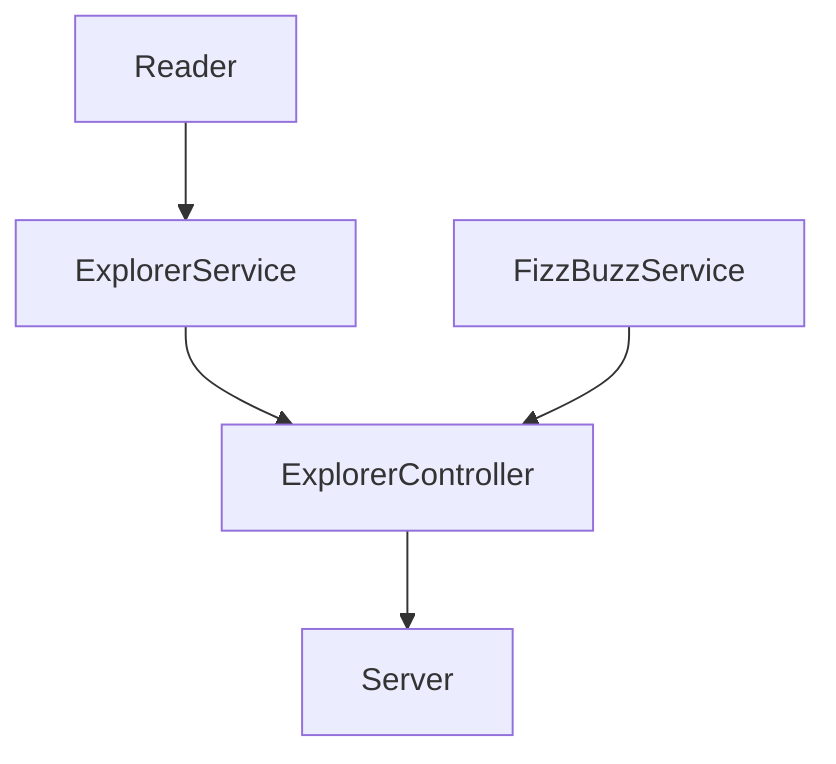
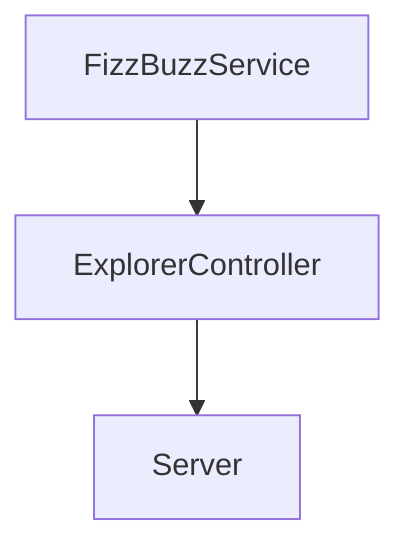

# FizzBuzz-New-Feature
Exercise 4 week 4 from LaunchX BackEnd mission
## New feature description
Create an endpoint to get a number and apply validation of fizzBuzz.

## Endpoints
| Endpoint | Request | Response |
|---|---|---|
| `localhost:3000/v1/fizzbuzz/:score` | `localhost:3000/v1/fizzbuzz/1` | `{score: 1, trick: 1}` |
| `localhost:3000/v1/fizzbuzz/:score` | `localhost:3000/v1/fizzbuzz/3` | `{score: 3, trick: "Fizzz"}` |
| `localhost:3000/v1/fizzbuzz/:score` | `localhost:3000/v1/fizzbuzz/5` | `{score: 5, trick: "Buzz"}` |
| `localhost:3000/v1/fizzbuzz/:score` | `localhost:3000/v1/fizzbuzz/15` | `{score: 15, trick: "Fizzbuzz"}` |

## Actual Design

## New feature

## Results
| Endpoint | Request | Response |
|---|---|---|
| `localhost:3000/v1/fizzbuzz/:score` | `localhost:3000/v1/fizzbuzz/3` |  |
| `localhost:3000/v1/fizzbuzz/:score` | `localhost:3000/v1/fizzbuzz/5` |  |
| `localhost:3000/v1/fizzbuzz/:score` | `localhost:3000/v1/fizzbuzz/15` |  |
| `localhost:3000/v1/fizzbuzz/:score` | `localhost:3000/v1/fizzbuzz/1` |  |

## Dependences 
- Express
- Eslint
- Jest
